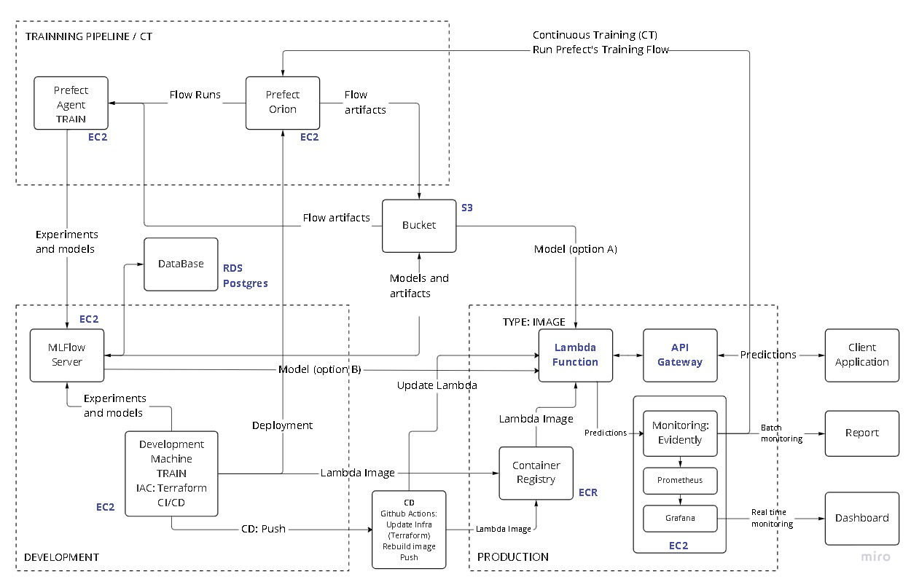

# mlops-taxi-prediction

This project consists on the development, deployment and monitoring of machine learning models following the best MLOps practices:
- Experiment tracking
- Model registry
- Workflow orchestration
- Containerization
- Cloud computing
- Infrastructure as Code
- Continuous integration, continuous deployment and continuous trainning
- Software engineering practices: code quality, code tests, pre-commit
- Model monitoring

The application will be able to predict the duration of a taxi trip in the city of Chicago.

- [mlops-taxi-prediction](#mlops-taxi-prediction)
  - [Dataset](#dataset)
  - [Technologies and tools](#technologies-and-tools)
  - [1. Requirements and setup (in the developer machine)](#1-requirements-and-setup-in-the-developer-machine)
  - [2.- Fork and clone repo. Prepare AWS credentials](#2--fork-and-clone-repo-prepare-aws-credentials)
  - [3.- Install dependencies](#3--install-dependencies)
  - [4.- Install pre-commit hooks](#4--install-pre-commit-hooks)
  - [5.- Infrastructure](#5--infrastructure)
    - [Build the infrastructure](#build-the-infrastructure)
    - [Test the infrastructure](#test-the-infrastructure)
  - [6. ML project cifecycle: Developing](#6-ml-project-cifecycle-developing)
  - [7. ML project cifecycle: ML pipeline](#7-ml-project-cifecycle-ml-pipeline)
    - [Trainning Pipeline: manual execution](#trainning-pipeline-manual-execution)
    - [Trainning pipeline: deployment/schedulling](#trainning-pipeline-deploymentschedulling)
  - [8. ML project cifecycle: Tests and CI](#8-ml-project-cifecycle-tests-and-ci)
    - [Tests](#tests)
    - [CI](#ci)
  - [9. ML project cifecycle: CD - Model deployment](#9-ml-project-cifecycle-cd---model-deployment)
  - [10. Monitoring](#10-monitoring)
  - [Notes](#notes)
  - [Useful commands and snippets](#useful-commands-and-snippets)
    - [Shell script](#shell-script)
    - [Prefect](#prefect)
  - [aws cli and aws-api](#aws-cli-and-aws-api)
  - [Pre-commit](#pre-commit)
  - [Docker-compose](#docker-compose)
  - [ToDo](#todo)
  - [Bugs](#bugs)

## Dataset
The dataset used is somehow basic (since the important matter here is MLOps): the Chicago Taxi Trips dataset to predict the trip duration. https://data.cityofchicago.org/Transportation/Taxi-Trips/wrvz-psew

The dataset is not available as files, so it is needed to access the api and requests the data, which is a more flexible way. In this project I have limited the amount of data for each month, since the accuracy of the models is not so important. You can easily modify it if you wish.

The goal is to implement a maturity level between 3 and 4 according to Microsoft (https://docs.microsoft.com/es-es/azure/architecture/example-scenario/mlops/mlops-maturity-model). In future projects, I will incorporate Data Version Controlling and Feature Storage.

## Technologies and tools
- Experiment tracking: Mlflow
- Model registry: Mlflow
- Workflow orchestration: Prefect
- Containerization: Docker
- Cloud computing: AWS
- Model monitoring: Evidently
- Software engineering practices: code quality (isort, black, pylint), testing (pytest), pre-commit
- Continuous integration, continuous deployment: Github Actions
- Continuous training: Evidently + Prefect
- Infrastructure as Code: Terraform

## 1. Requirements and setup (in the developer machine)

- Python 3.9 (recommended to install Anaconda: https://www.anaconda.com/)
- Docker
- docker-compose
- Git (if you are using window: https://gitforwindows.org/)
- Git Bash (only if you are using windows: https://gitforwindows.org/)
- Github account with aws secrets set-up in the repository (that one forked by you, see below)
- AWS account with permissions to create infrastructure
  - AWS access key (id and secret)
- AWS cli (command line interface)
  - Download and install AWS cli
    - https://docs.aws.amazon.com/cli/latest/userguide/getting-started-install.html
    - Windows:
      ```
      msiexec.exe /i https://awscli.amazonaws.com/AWSCLIV2.msi
      aws --version
      aws-cli/2.4.24 Python/3.8.8 Windows/10 exe/AMD64 prompt/off
      ```
    - Linux: (unzip required)
      ```
      curl "https://awscli.amazonaws.com/awscli-exe-linux-x86_64.zip" -o "awscliv2.zip"
      unzip awscliv2.zip
      sudo ./aws/install
      ```
  - Configure AWS account with AWS cli
      ````bash
      aws configure
        AWS Access Key ID [None]: [your aws key id]
        AWS Secret Access Key [None]: [your asw secret access key]
        Default region name [None]: eu-west-1
        Default output format [None]:
      Check with aws sts get-caller-identity
      ```
- Terraform
  Terraform will be used to build the infrastructure as code. Terraform requires a status file to manage the infrastructure. This may be local or remote. In this case, we will use a remote file, stored in S3, so the S3 bucket has to be created manually.
  - Download Terraform executable: `https://www.terraform.io/downloads`
    - Windows: Just save it to ./infrastructure directory
    - Linux: Follow the instructions on `https://www.terraform.io/downloads`
  - Create terraform backend bucket to keep Terraform state:
    Note: bucket names shall be unique. Choose your location accordingly.
    Note: bucket is private, but anyone with appropriate permissions can grant public access to objects.
    ```bash
    aws s3api create-bucket --bucket [your bucket name] --create-bucket-configuration LocationConstraint=eu-west-1
    ```

## 2.- Fork and clone repo. Prepare AWS credentials

Go to: `https://github.com/MarcosMJD/mlops-chicago-taxi`

And fork the repo
Then clone the forked repo in your machine
`git clone https://github.com/MarcosMJD/mlops-chicago-taxi`

You will need to upload the AWS credentials to yout git repo in order to run the CI/CD workflows:
Please, follow the instructions in this video:
https://youtu.be/xkTWF9c33mU?list=PL3MmuxUbc_hIUISrluw_A7wDSmfOhErJK&t=1036


## 3.- Install dependencies

Go to sources directory and run:
```
pip install --upgrade pip
pip install pipenv
pipenv install --dev
pipenv shell
```

Note that Pipfile lists the specific versions in use.

## 4.- Install pre-commit hooks

Go to the root directory of the repo and run:
```
pre-commit install
git add .pre-commit-config.yaml
```
This last step is needed because .git folder is not cloned and pre-commits live there

## 5.- Infrastructure

For the sake of simplicity only one set of infrastructure will be created: the staging infrastructure.
The production infrastructure may be created in the same way (currently not implemented), by changing the name of the resources.
Hence, the CI/CD workflows will be performed in the staging infrastructure, based on pull-requests or pushes into the develop branch

The following picture depicts the architecture:
<p align="left">
  
</p>
Note: Blue color means AWS service

Common layer:
- S3 bucket will store both Prefect artifacts and MLflow artifacts (including the models for each experiment).
- RDS Postgres database is used by Mlflow to store the metadata of experiments.

Development layer:
- MLflow server runs on its own EC2 instance.
- Development machine.
  - Used to perform all tasks explained in this document.
  - Used to run the prefect agent for the deployment of the trainning pipeline with Prefect.
  - Used to run batch monitoring with Evidently.

Trainning pipeline:
- Prefect Orion runs on its own EC2 instance.

Production layer:
A serverless solution is used:
- Lambda function that loads the Lambda image from ECR registry and the model from S3, and makes the predictions based on requests coming from the API gateway.
- API gateway provides the API for the client application.
- ECR stores the Lambda Docker image of that will be used by Lambda service to launch the container.

### Build the infrastructure

**In Windows, use Git Bash in this step**

- Go to `infrastructure` directory, edit `stg.tfvars` and modify the variable `s3_bucket_name_suffix`
This variable is used to create the name of the S3 bucket, so suffix will avoid conflicts with existing buckets in your aws zone.

- Edit `main.tf` file in `infrastructure` directory and modify the backend location for Terraform (the name of the S3 bucket you have created manually before)
  ```
    backend "s3" {
      bucket  = "chicago-taxi-tfstate-mmjd" <- Use your own bucket name
  ```

- Build the infrastructure
  ```
  cd infrastructure
  ./terraform.exe init
  terraform plan --var-file=stg.tfvars
  terraform apply --var-file=stg.tfvars
  yes
  ```

  Terraform will autmatically create the Lambda image and upload it to ECR (before creating the Lambda function).
  For the creation of the Lambda image, the files in the `production` folder will be used.

  From the Terraform output, please get the output values and execute the following statements (Please, fill the fields accordingly):
  ```
  prefect config set PREFECT_API_URL="http://<prefect_external_ip>:8080/api"
  export MLFLOW_TRACKING_URI="http://<mlflow_external_ip>:8080"
  export PROJECT_NAME="chigaco_taxi"
  export PROJECT_ID_HYPHENS="chicago-taxi"
  export BUCKET_NAME="<bucket_name>"
  export API_GATEWAY_BASE_URL="<api_gateway_base_url>
  ```

### Test the infrastructure

At this point, the lambda function loads a dummy model, since we have not run any experiment.
Go to sources/tests directory and run
`python ./test_api_gateway_lambda.py`

It should answer with a prediction of 40.

## 6. ML project cifecycle: Developing

Data scientist will perform some EDA, feature engineering, and train and evaluate some models.
In this project, the performance of the model is not so important, but the process of the generation of the model is.
This is a regression problem. For the sake of simplicity, the features used are
`pickup_community_area` and `dropoff_community_area` and the target is `trip_seconds`, with some preprocessing such as converting to minutes.

Go to sources/development directory and run
`Jupyter notebook`
Go to your browser, load `model_development.ipynb`
And run the notebook

Data is downloaded from Chicago Taxi Dataset API and stored in the directory `./data` as csv and parquet formats.
Data is limited to 2 days in order to run eveything faster. You may change the dates in the notebook.
Train month is February 2022 and Validation is March 2022.
The models used are [GradientBoostingRegressor, ExtraTreesRegressor, LinearRegression, Lasso, Ridge, LinearSVR]
During this phase, MLflow is used for experiment tracking. Check your experiments and models in the mlflow server url
`http://<mlflow_external_ip>:8080`
The best three models are registered in MLflow model registry and the best one in `production` stage.
Please, note that to deploy the model, we do not use the model registry but take the model directly from the S3 bucket where models are stored as artifacts in each experiment. MLflow autolog is used.

## 7. ML project cifecycle: ML pipeline

From the Jupyter notebook, the following python modules/scripts are created:
`downloader.py`: Downloads data from the Chicago Taxi API and stores the datasets in csv format.
`model.py`: Manages the model (actually sklearn pipeline with DictVectorizer and Model): creates the model, preprocess datasets, fits and predicts.
`preprocessor.py`: Perform the preprocessing of the datasets, also generates the parquet format
`trainning_pipeline.py`: Implements the trainning pipeline as a @flow with the following tasks:
- `preprocess_datasets`
- `train_models`
- `register_models`

Basically the pipeline performs the same taks as the jupyter notebook, so MLflow is used and the best models registered.

The trainning pipeline may be executed manually or as part of a Prefect deployment.

### Trainning Pipeline: manual execution

Go to `sources/development` and run:
`python trainning_pipeline.py`
Check your flow run in prefect server url
`http://<prefect-external-ip>:8080`

### Trainning pipeline: deployment/schedulling

Make the Prefect deployment:

  Go to `sources/development` and run:
  `python prefect_deployment.py`
  This script will create, in prefect orion server, the storage block (a folder in the S3 bucket), the queue and the deployment itself.

  Go to Prefect server url and check the deployment, block and queue.

Run trainning pipeline by agent:

  Firstly, to start the agent, run:
  `prefect agent start chicago-taxi`

  Secondly, to launch the run of the deployment, on another shell (i.e. Git Bash) do:
  - Go to `sources` directory, execute `pipenv shell`
  - Run `prefect config set PREFECT_API_URL="http://<prefect-external-ip>:8080/api"` <- Use the external ip of the Prefect server build on the IaC phase.
  - Run `prefect deployment run main-flow/chicago-taxi-deployment`

Check that the Agent executes the flow.

## 8. ML project cifecycle: Tests and CI

Model deployment will be part of the CI/CD.

The modules/scripts under `production` folder implements the ML prediction server by means of loading the model and make predictions being requested by clients apps through API gateway to Lambda function. In other words, the predictions are made by the Lambda function.
- chicago_taxi_prediction.py:
  - Initializes the ModelService class.
  - Implements the lambda_handler (the function called by Lambda service), that uses ModelService to execute predictions.
    - Receives the http request (coming from the API gateway to Lambda function)
    - Extracts the features from the body of the http request
    - Calls ModelService to make the prediction
    - Creates and sends back the http response with the prediction object.
- model_service.py (class ModelService)
  - Loads the model, whether on a local path, S3 or a Dummy model.
  - Makes predictions.


The lambda function parameters are the following, passed as env variables during the creation (Terraform) or update (CD, see below) of the Lambda function, for instance:
MLFLOW_MODEL_LOCATION="s3"
MLFLOW_EXPERIMENT_ID="4"
MLFLOW_RUN_ID="2f45030a9a4d41888b811884d5e71de1"
MLFLOW_BUCKET_NAME="stg-chicago-taxi-mmjd"
MLFLOW_BUCKET_FOLDER="mlflow"

### Tests

Unit tests are found under the `tests/unit_tests` directory.

Integration tests are found under `tests/integration_tests` directory.
Integration tests are done by creating a Lambda image from the sources under `production` directory, running the container, and testing with a predefined prediction. Everything runs locally.

These test are part of the CI workflow that will see later, but these tests and also quality checks can be executed manually with the Makefile under the `sources` directory.
Go to `sources`directory and run:
`make integration_tests` (this will execute all tests and quality checks)
- Unit tests -> Runs ./unit_tests/run.sh
- Quality checks (isort, black, pylint)
- Build local image
- Integration tests runs ./integration_tests/run.sh (also runs the container)

You can also run manually the sh tests scripts, from the sources directory.

### CI

The CI will ensure that this code works and its quality by using pre-commit hooks:

- trailing-whitespace
- end-of-file-fixer
- check-yaml
- check-added-large-files
- isort
- black
- pylint
- pytest
  -   unit_tests
  -   integration_tests

Check `.pre-commit-config.yaml` in the `root` directory of the repo for further details.

Run the CI workflow:

The CI workflow definition can be found in `ci-tests.yml`, in `.github/workflows` directory.
Please, note that CI is set to be run on a pull-request on the `develop` branch.
It runs unit tests and integration tests and checks that the infrastructure definition is correct with `Terraform plan` command.

Execute/do:
- `git checkout -b ＜new-branch＞ develop` <- E.g. <new-branch> = "Feature1"
- Modify any file in the sources directory
- `git add -A`
- `git commit -m 'test ci/cd'` <- pre-commit hooks will be executed
- `git push`
- go to `github.com` to your forked repo and...
- go to Pull requests
- Click on New pull request
- Select base: develop
- Compare: <new-branch>
- Click Create pull request
- Click Create pull request
- Go to Actions
- Check CD test sucessfully passed

## 9. ML project cifecycle: CD - Model deployment

When the infrastructure is build, the Lambda function is initialized with the default parameters, that means that a dummy model is used. As an example, we will update the lambda function with the model of the last experiment. Better approaches may be used, such as using MLflow model registry.

The definition of the CD workflow is in `cd-deploy.yml`, in `.github/workflows` directory. It will:
- Create/update the infrastructure
- Build the Lambda image
- Push the Lambda image to ECR
- Update the Lambda function parameters (i.e. load the model)

During the CD phase, the Lamba function will be updated with the following parameters:
MLFLOW_MODEL_LOCATION="s3", \
MLFLOW_EXPERIMENT_ID=$EXPERIMENT_ID, \
MLFLOW_RUN_ID=$RUN_ID, \
MLFLOW_BUCKET_NAME=$MODEL_BUCKET, \
MLFLOW_BUCKET_FOLDER=$BUCKET_FOLDER,
Where $EXPERIMENT_ID and $RUN_ID are those of the latest experiment, calculated in during the CD execution.

Execute/do:

- Go to Pull requests
- Click on Merge pull request
- Click on Confirm Merge
- Go To Actions, CD-Deploy shall be executing

After sucessfully finalized, test the new model configuration
Got to `sources/tests directory` and run:
`python ./test_api_gateway_lambda.py`


## 10. Monitoring

In this project, batch monitoring has been implemented by using evidently library from Evidently AI. Data drift and regression performance are implemented.
A report is created with data drift and regression performance sections.
Data drift is tested and the trainning pipeline is scheduled if data drift (more than 30% of features with detected data drift) is detected (a prefect agent will take care of the flow execution).

The source code is under the folder `sources\monitoring`

Three elements are needed:
- send_data.py script
- Mongo database (lanched from docker-compose)
- batch_monitoring.py script

The reference dataset is: `Taxi_Trips_2022_03.parquet` (i.e. March), under `reference_data` directory.

To simulate the real case usage of the system, the module `send_data.py` performs some tasks:
- Reads from a more recent dataset `Taxi_Trips_2022_04.parquet` (i.e. April), iterating row by row, and request predictions by sending http requests to the API gateway.
- Processes and stores the target values in a csv file, together with the id field of each record of data. In other words, when the customer arrives at the destination, the target value (trip duration) is known, and stored.
- Stores the predictions in the Mongo database.

The batch_monitoring script will:
- Read the csv file with the target values and add them to each record in the mongo db. id field is used as the key to match the prediction with the target.
- Reads the reference datasets, processes the target value (trip duration) and makes the predictions.
- Fetches the data from the database.
- Calculates the metrics and generates the report.
- Triggers the trainning pipeline (i.e. schedules a flow in prefect) if DataDrift is detected (more than 30% of features with detected data drift)

Monitoring exection:

Note that the prediction service must be up and running
- Go to `./sources/monitoring`
- `docker-compose up`
- `python ./send_data.py` (wait for some predictions to be made)
- `python ./match_monitoring.py`

Data drift shall be detected and a flow scheduled. You can check it in the prefect orion url. If an agent has been launched, the trainning pipeline shall run.


## Notes

Since we use tag latest and the same image name and same ECR, by simply terraform apply will make and push de image, but not update lambda function code (the container itself), because lambda parameters (those parameters used to create the lambda function) do not change.
Check Terraform plan in CI phase. In CI phase, we set the env vars to default.
In CD, we build and push the image again, but not update the lambda image. What we do is update the function configuration with the environment vars to update the model, these are not lambda parameters
To update lambda image, we need to use update-function-code --image-uri or do it manually in the console.

## Useful commands and snippets

### Shell script

Header of a sh script
"#!/usr/bin/env bash"

Returns the directory where the Bash script file is saved
"$(dirname "$0")"

Get last error code
ERROR_CODE=$?

### Prefect

o create programmatically an storage block in prefect:
from prefect.filesystems import S3
block = S3(bucket_path="chicago-taxi-fc4rdz8d")
block.save("example-block")

Then to build a deployment
prefect deployment build trainning_pipeline.py:main_flow --name test --tag test --storage-block s3/example-block -q test
This will upload the .py files to S3 bucket

Or with object:

To create the deployment and queue (in prefect orion server), and also upload to S3 the yaml file:
prefect deployment apply .\main_flow-deployment.yaml

To start an agent
prefect agent start -q 'test'

To run a flow
prefect deployment run <FLOW_NAME>/<DEPLOYMENT_NAME>

## aws cli and aws-api

Download object from aws s3
aws s3api get-object --bucket stg-chicago-taxi-fc4rdz8d --key mlflow/2/e4ff37b7254a408c86826fb2a25573a9/artifacts/model/conda.yaml ./conda.yaml

Download folder from aws s3
aws s3 cp s3://stg-chicago-taxi-fc4rdz8d/mlflow/2/e4ff37b7254a408c86826fb2a25573a9/artifacts/model ./model --recursive

Get latest RUN_ID from latest S3 partition. In practice, this is generally picked up from a tool like MLflow or a DB

export RUN_ID=$(aws s3api list-objects-v2 --bucket ${MODEL_BUCKET_DEV} \
--query 'sort_by(Contents, &LastModified)[-1].Key' --output=text | cut -f2 -d/)

Copy between buckets
`aws s3 sync s3://${MODEL_BUCKET_DEV} s3://${MODEL_BUCKET_PROD}`

Update lambda env vars
https://docs.aws.amazon.com/lambda/latest/dg/configuration-envvars.html
`aws lambda update-function-configuration --function-name ${LAMBDA_FUNCTION} --environment "Variables=${variables}"`

## Pre-commit

Create a default precommit hook:
  pre-commit sample-config > .pre-commit-config.yaml
  pre-commit install
  git add .pre-commit-config.yaml

Pytest only adds to sys.path directories where test files are, so you need to add the sources directory with:
export PYTHONPATH=. fro sources directory

You alternatively can run
python -m pytest

## Docker-compose
Stop services only
docker-compose stop

Stop and remove containers, networks..
docker-compose down

Down and remove volumes
docker-compose down --volumes

Down and remove images
docker-compose down --rmi <all|local>

## ToDo

- Review id vs trip_id in the fields
- Calculate the day of the end of the month using timedeltas
- Review the categorial features in examples. Shall be string calculated from integer
- Launch an EC2 machine for developer and configure all the tools automatically
- Check which folder is used in CI workflow (sources? or production?)
- Prefect Agent in EC2
- Manage the CI part when the image is updated with parameters "", since in CI a dummy model is in use. Well it does not matter since in CD the real model will be used anyway.
- Use mlflow model registry to get stg model. Check how to do also in CD.
- Monitoring in real time in EC2
- Run monitoring in batch mode with prefect deployment - scheduled each month
- Pass parameters to prefect flows/deployment
- Check the list of files that triggers the build of new image in CI
- Fix problems with isort and black figthing each other.
- Separate creation of s3 bucket, mlflow and prefect servers from the rest to avoid recreation of these in CD because of random generation number. Use random number generation again.
- For some reason, CD sees that user_data in EC2s change and reconstructs them
- Check outputs of the models during trainning, check debug of sample 25. Some of them are [] and some not?
- Manage passwords (e.g. database) in aws
  - mlflow https://docs.aws.amazon.com/sdk-for-java/latest/developer-guide/setup-credentials.html
- Make user_data in EC2 persistent, so that after reboot the ec2, it still works
- Check lib versions in pipfiles
- Use S3 to store datasets
- Check no cache when using pipenv in Dockerfile
- Check why aws config initialization fails when github actions if profile default is set in main.tf
- Modify model and preprocessor to use pipeline or model
- ¿Deployment en Makefile?
- Test localstack aws gateway + ECR + lambda + S3
- In dev system... maybe script:
  - Set mlflow env var for the server
  - Set prefect to use prefect server api
  - More ignore files in prefect

## Bugs
 - None known
